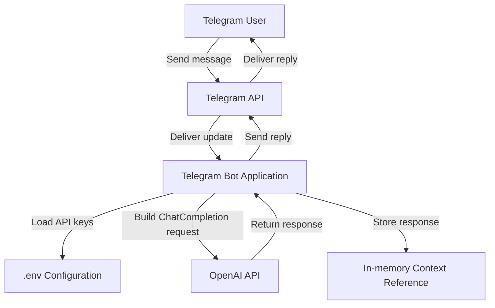

# Architecture Workflow

```mermaid
flowchart TD
    User[Telegram User]
    Telegram[Telegram API]
    Bot[Telegram Bot Application]
    OpenAI[OpenAI API]
    Env[.env Configuration]
    Reference[In-memory Context Reference]

    User -->|Send message| Telegram
    Telegram -->|Deliver update| Bot
    Bot -->|Load API keys| Env
    Bot -->|Build ChatCompletion request| OpenAI
    OpenAI -->|Return response| Bot
    Bot -->|Store response| Reference
    Bot -->|Send reply| Telegram
    Telegram -->|Deliver reply| User
```