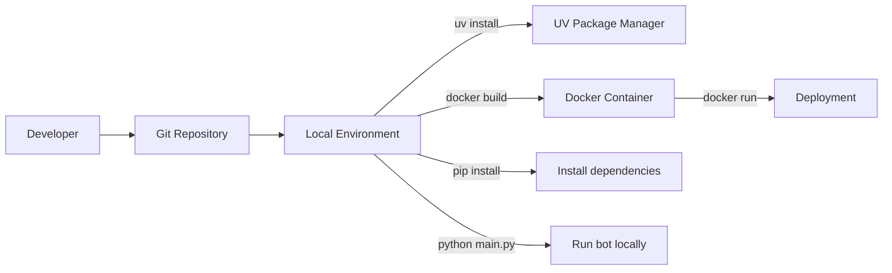

# Deployment Workflow

```mermaid
flowchart LR
    Dev[Developer]
    Repo[Git Repository]
    Local[Local Environment]
    UV[UV Package Manager]
    Docker[Docker Container]
    Production[Deployment]

    Dev --> Repo
    Repo --> Local
    Local -->|pip install| Dependencies[Install dependencies]
    Local -->|uv install| UV
    Local -->|python main.py| Runtime[Run bot locally]
    Local -->|docker build| Docker
    Docker -->|docker run| Production
```