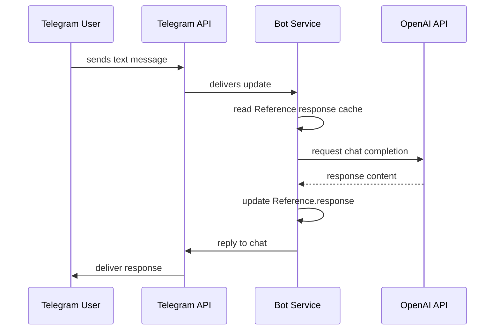

# Runtime Workflow

```mermaid
sequenceDiagram
    participant User as Telegram User
    participant Telegram as Telegram API
    participant Bot as Bot Service
    participant OpenAI as OpenAI API

    User->>Telegram: sends text message
    Telegram->>Bot: delivers update
    Bot->>Bot: read Reference response cache
    Bot->>OpenAI: request chat completion
    OpenAI-->>Bot: response content
    Bot->>Bot: update Reference.response
    Bot->>Telegram: reply to chat
    Telegram->>User: deliver response
```